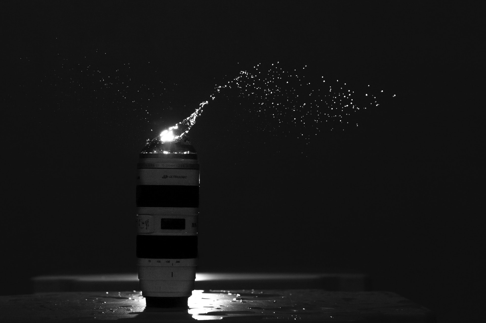

# UASPPW1_22-499991-SV-21383_San-Productions
Dibuat untuk memenuhi penugasan sebagai nilai UAS PPW1

Nama : Akhmad Maulana Akhsan

NIM  : 22/499991/SV/21383

------------------------------------------------------- Nomer 1 ----------------------------------------------------------

1. Penjelasan web secara umum

Website yang dibuat adalah situs untuk SAN Productions, sebuah layanan fotografi profesional. Tujuan dari website ini adalah untuk memberikan informasi tentang layanan fotografi yang ditawarkan oleh SAN Productions, seperti fotografi produk, potret, dan dokumentasi acara. Klien yang membutuhkan website ini adalah SAN Productions sebagai penyedia layanan fotografi. Melalui website ini, SAN Productions ingin menjangkau calon klien potensial yang membutuhkan jasa fotografi mereka.

Website ini mencoba menangani beberapa permasalahan yang umum terkait dengan penyediaan layanan fotografi, seperti:

- Informasi yang tidak mudah diakses: Website ini memberikan informasi yang lengkap tentang layanan fotografi yang ditawarkan, termasuk harga, durasi pemotretan, dan contoh-contoh hasil fotografi.
- Komunikasi yang kurang efektif: Website ini menyediakan formulir kontak dan informasi kontak yang memudahkan pengguna untuk menghubungi SAN Productions untuk pertanyaan, permintaan penawaran, atau pemesanan.
- Presentasi visual yang menarik: Website ini menggunakan desain yang rapi dan menarik dengan gambar-gambar yang menggambarkan kualitas dan keahlian fotografi yang ditawarkan oleh SAN Productions.

Berikut adalah penjelasan untuk setiap bagian/section pada website SAN Productions:

a. Navbar

- Tujuan: Navbar (navigasi bar) digunakan untuk memberikan navigasi yang konsisten dan mudah diakses ke berbagai halaman atau bagian utama website. Tujuannya adalah untuk memudahkan pengunjung dalam menjelajahi konten website.
- Konten: Terdiri dari daftar tautan (links) atau menu yang mengarahkan pengunjung ke halaman utama, layanan, portofolio, tentang perusahaan, blog, dan halaman kontak.

b. Hero Section:

- Tujuan: Bagian ini merupakan bagian pertama yang dilihat oleh pengunjung saat mengakses website. Tujuannya adalah untuk menarik perhatian pengunjung dan memberikan gambaran singkat tentang SAN Productions.
- Konten: Terdiri dari judul yang menarik, slogan atau tagline yang memperkenalkan SAN Productions, dan mungkin juga gambar atau elemen visual yang menarik perhatian.

c. About Section:

- Tujuan: Bagian ini memberikan informasi tentang SAN Productions sebagai perusahaan fotografi. Tujuannya adalah untuk memperkenalkan tim, pengalaman, dan nilai-nilai perusahaan kepada pengunjung.
- Konten: Terdiri dari deskripsi singkat tentang perusahaan, tim fotografer yang berpengalaman, dan nilai-nilai unik yang membedakan SAN Productions dari kompetitor.

d. Promo Section

- Tujuan: Bagian ini dirancang untuk menampilkan promosi atau penawaran khusus yang sedang berlangsung. Tujuannya adalah untuk menarik perhatian pengunjung dan mendorong mereka untuk mengambil tindakan, seperti memesan sesi fotografi atau menggunakan layanan dengan diskon. Visual dari section ini dibuat menarik dengan penggunaan efek carousel.
- Konten: Terdiri dari gambar menarik yang memperlihatkan promosi, judul yang menarik, deskripsi singkat tentang promosi, dan tombol tindakan yang mengarahkan pengunjung ke halaman pemesanan atau informasi lebih lanjut.

e. Production Section

- Tujuan: Tujuan dari section "production" adalah untuk memberikan pemahaman yang jelas dan ringkas tentang proses yang harus dilalui pengunjung untuk mendapatkan hasil foto yang memuaskan. Ini juga sebagai penarik minat para pengunjung website.
- Konten : Terdiri dari empat langkah atau tahapan yang harus dilalui oleh pengunjung. Setiap langkah memiliki judul, deskripsi, dan ikon yang menggambarkan langkah tersebut.

f. Services Section

- Tujuan: Bagian ini memberikan informasi tentang layanan fotografi yang ditawarkan oleh SAN Productions. Tujuannya adalah untuk memperjelas jenis layanan yang tersedia dan menggambarkan keahlian dan pengalaman perusahaan dalam setiap bidang.
- Konten: Terdiri dari daftar layanan yang disediakan, seperti fotografi produk, potret, dokumentasi acara, dan sebagainya. Setiap layanan dapat disertai dengan deskripsi singkat dan contoh-contoh hasil fotografi.

g. Portfolio Section

- Tujuan: Bagian ini menampilkan portofolio atau contoh-contoh hasil fotografi dari SAN Productions. Tujuannya adalah untuk memamerkan kualitas dan keahlian fotografi perusahaan kepada pengunjung.
- Konten: Terdiri dari galeri foto atau tampilan grid yang menampilkan berbagai contoh fotografi yang telah dilakukan oleh SAN Productions. Setiap foto dapat diklik untuk memperbesar dan menampilkan detail lebih lanjut.

h. Testimonials Section:

- Tujuan: Bagian ini menampilkan testimonial atau pendapat dari klien yang puas dengan layanan SAN Productions. Tujuannya adalah untuk membangun kepercayaan dan meyakinkan pengunjung tentang kualitas layanan perusahaan.
- Konten: Terdiri dari kutipan testimonial dari klien, disertai dengan nama klien dan mungkin juga foto klien. Testimonial dapat dikelompokkan berdasarkan jenis layanan atau proyek yang dilakukan.

i. Contact Section

- Tujuan: Bagian ini menyediakan informasi kontak kepada pengunjung yang ingin menghubungi SAN Productions. Tujuannya adalah untuk memudahkan proses komunikasi antara pengunjung dan perusahaan.
- Konten: Terdiri dari formulir kontak atau daftar informasi kontak seperti alamat, nomor telepon, dan alamat email. Pengunjung dapat mengisi formulir untuk mengirim pesan atau menggunakan informasi kontak yang disediakan.

j. Footer Section:

- Tujuan: Bagian ini berada di bagian bawah halaman dan menyediakan informasi tambahan serta tautan yang berguna kepada pengunjung.
- Konten: Terdiri dari tautan ke halaman-halaman penting lainnya seperti beranda, tentang kami, layanan, portofolio, dan kontak. Juga dapat mencakup informasi hak cipta, ikon media sosial, dan sebagainya.

------------------------------------------------------------------------------------------------------------------------------------------------------

----------------------------------------------- Nomer 2 --------------------------------------------------------

2. Bagaimana website yang dibuat menjawab 4 requirement dasar (kriteria penilaian)

a. Desain rapi mengikuti kaidah atau prinsip desain,
  - Section Services
   <!-- Section Services -->
    <section class="services" id="services">
      

        <header>
          

            <h2>Our Services</h2>
          

          

            
We offer a wide range of professional photography services to meet your needs:

          

        </header>
        <main>
          

            

              

                

                  <h4 class="my-0 fw-normal">Product</h4>
                

                

                  
                  <h1 class="card-title pricing-card-title">Start<small class="text-body-secondary fw-light"> $100</small></h1>
                  <ul class="list-unstyled mt-3 mb-4">
                    <li>Shooting Duration: 4-6 hours</li>
                    <li>Photo Editing Duration: 2-3 days</li>
                    <li>20 high-resolution edited photo</li>
                    <li>for e-commerce, catalogs, brochures, and more</li>
                  </ul>
                  <button type="button" class="w-100 btn btn-lg btn-outline-danger">Sign up for free</button>
                

              

            

            <!-- Menambahkan gambar dan informasi lain pada layanan Pro -->
            

              

                

                  <h4 class="my-0 fw-normal">Portrait</h4>
                

                

                  
                  <h1 class="card-title pricing-card-title">Start<small class="text-body-secondary fw-light"> $150</small></h1>
                  <ul class="list-unstyled mt-3 mb-4">
                    <li>Shooting Duration: 2-3 hours</li>
                    <li>Photo Editing Duration: 1-2 days</li>
                    <li>10 high-resolution edited photo</li>
                    <li>for individuals, families, couples, parent, and more</li>
                  </ul>
                  <button type="button" class="w-100 btn btn-lg btn-outline-danger">Get started</button>
                

              

            

            <!-- Menambahkan gambar dan informasi lain pada layanan Enterprise -->
            

              

                

                  <h4 class="my-0 fw-normal">Wedding</h4>
                

                

                  
                  <h1 class="card-title pricing-card-title">Start<small class="text-body-secondary fw-light"> $500</small></h1>
                  <ul class="list-unstyled mt-3 mb-4">
                    <li>Shooting Duration: 1-3 days</li>
                    <li>Photo Editing Duration: 1-2 weeks</li>
                    <li>150 high-resolution edited photo</li>
                    <li>for prewedding shoots, wedding day coverage, and more</li>
                  </ul>
                  <button type="button" class="w-100 btn btn-lg btn-outline-danger">Contact us</button>
                

              

            

          

        </main>
      

    </section>
    <!-- Akhir Services-->
Penjelasan :

Secara visual, desain dari section Services terlihat rapi dan mengikuti kaidah atau prinsip desain yang baik. Pertama, penggunaan grid dalam menampilkan layanan fotografi membuat tata letaknya terstruktur dan teratur. Setiap layanan ditempatkan dalam kolom yang sama ukurannya, menciptakan keseimbangan visual yang menyenangkan bagi mata pengguna. Ikon yang digunakan juga sesuai dengan jenis layanan yang ditawarkan, memberikan indikasi visual yang jelas tentang apa yang akan didapatkan pengguna.

Selain itu, judul dan deskripsi layanan ditampilkan dengan jelas dan mudah dibaca. Penggunaan font yang sesuai dan ukuran teks yang konsisten memberikan kejelasan dan keterbacaan informasi. Adanya kontras warna antara teks dan latar belakang juga membantu pengguna untuk dengan mudah memperhatikan dan memahami konten yang disajikan.

- Section Portfolio

 <!-- portfolio section -->
    <section id="portfolio" class="py-7">
      

        

          <h2>Our Last Work</h2>
          

            

            

            

            

            

            

            

          

        

      

    </section>
    <!-- end of portfolio section -->

Penjelasan :

Dalam section Portfolio, desainnya juga menunjukkan kekompakan dan rapi yang mengikuti prinsip desain yang baik. Judul "Our Last Work" ditampilkan dengan tata letak yang terpusat, menggunakan ukuran teks yang besar dan diberi penekanan visual dengan penggunaan elemen span yang berbeda warna. Hal ini memberikan fokus yang jelas kepada pengguna tentang apa yang akan dilihat dalam bagian ini.

Tampilan grid untuk menampilkan item-item portfolio memberikan tampilan yang terstruktur dan konsisten. Setiap item ditempatkan dalam kotak yang sama ukurannya dan memiliki jarak yang konsisten antara satu dengan yang lainnya. Efek transformasi saat hover memberikan respons interaktif yang menarik tanpa mengganggu keterbacaan konten.

Pengaturan responsif pada section Portfolio juga menunjukkan perhatian terhadap pengguna yang mengakses melalui perangkat dengan lebar layar yang berbeda. Pengaturan grid yang berubah sesuai dengan lebar layar memberikan tampilan yang optimal baik pada perangkat desktop maupun perangkat mobile, memastikan pengalaman pengguna yang konsisten dan nyaman.

b. Website responsive, dapat diakses melalui device: Mobile, Tablet dan Laptop

     <!-- Media Queries Section Portfolio -->
         @media (max-width: 768px) {
       .portfolio-content {
         max-width: 80%;
         margin: 0 auto;
       }
     
       .portfolio-grid {
         grid-template-columns: repeat(2, 1fr);
         grid-gap: 1rem;
       }
     }
     
     @media (min-width: 768px) {
       .portfolio-grid {
         grid-template-columns: repeat(3, 1fr);
       }
       .portfolio-grid > div:nth-child(2) {
         grid-column: 2 / 4;
       }
       .portfolio-grid > div:nth-child(6) {
         grid-column: 1 / 3;
       }
     
       #portfolio {
         padding-top: 8rem;
         background-color: var(--bg);
         height: 140vh;
       }
     }
     
     @media (max-width: 450px) {
       .portfolio-content {
         max-width: 90%;
         margin: 0 auto;
       }
     
       .portfolio-grid {
         grid-template-columns: 1fr;
         grid-gap: 1rem;
       }
     }
     
     @media (min-width: 450px) {
       .portfolio-grid {
         grid-template-columns: repeat(2, 1fr);
       }
       .portfolio-grid > div {
         height: 300px;
         overflow: hidden;
       }
       .portfolio-grid > div img {
         width: 100%;
         height: 100%;
         object-fit: cover;
       }
     
       #portfolio {
         padding-top: 8rem;
         background-color: var(--bg);
         height: 174vh;
       }
     }
    <!-- end of media queries portfolio -->

Penjelasan :

Kode di atas mengatur tampilan konten dinamis pada website untuk berbagai ukuran layar, yaitu untuk laptop, tablet, dan mobile phone. Dalam media query dengan max-width: 768px, terdapat beberapa penyesuaian yang dilakukan untuk tampilan pada ukuran layar mobile phone dan tablet. Pertama, max-width dari .portfolio-content diatur menjadi 80% dengan margin auto untuk memberikan lebar yang lebih optimal pada ukuran layar tersebut. Selain itu, .portfolio-grid diatur dengan grid-template-columns menjadi repeat(2, 1fr) dan grid-gap: 1rem untuk menyesuaikan tata letak kolom pada ukuran layar tersebut.

Selanjutnya, dalam media query dengan min-width: 768px, dilakukan penyesuaian tampilan pada ukuran layar tablet dan laptop. .portfolio-grid diatur dengan grid-template-columns menjadi repeat(3, 1fr) untuk menyesuaikan tata letak kolom pada ukuran layar tersebut. Beberapa div dalam .portfolio-grid juga diatur dengan grid-column secara spesifik untuk menentukan tata letak kolom yang diinginkan. Selain itu, padding-top dari #portfolio diatur menjadi 8rem untuk memberikan penyesuaian visual yang optimal pada ukuran layar tersebut.

Kemudian, dalam media query dengan max-width: 450px, terdapat penyesuaian tampilan pada ukuran layar mobile phone yang lebih kecil. .portfolio-content diatur dengan max-width: 90% dan margin auto untuk memberikan lebar yang lebih optimal pada ukuran layar tersebut. .portfolio-grid diatur dengan grid-template-columns menjadi 1fr untuk menyesuaikan tata letak kolom pada ukuran layar tersebut.

Terakhir, dalam media query dengan min-width: 450px, dilakukan penyesuaian tampilan pada ukuran layar tablet dan laptop. .portfolio-grid diatur dengan grid-template-columns menjadi repeat(2, 1fr) untuk menyesuaikan tata letak kolom pada ukuran layar tersebut. Beberapa div dalam .portfolio-grid diatur dengan tinggi 300px dan overflow: hidden untuk memastikan gambar yang melebihi batas div tidak terlihat. Gambar dalam div diatur dengan width: 100%, height: 100%, dan object-fit: cover untuk mengisi seluruh ruang div dengan gambar yang sesuai proporsi. Selain itu, padding-top dari #portfolio diatur menjadi 8rem untuk memberikan penyesuaian visual yang optimal pada ukuran layar tersebut.

c. Direct feedback ke pengguna website

     function submitForm(event) {
       event.preventDefault(); // Mencegah pengiriman form secara default
     
       // Mendapatkan nilai input dari form
       var name = document.getElementById('floatingName').value;
       var email = document.getElementById('floatingEmail').value;
       var message = document.getElementById('floatingMessage').value;
     
       // Menampilkan nama, email, dan pesan yang dikirim
       var messageDiv = document.getElementById('message');
       messageDiv.innerHTML = 'Thank you, ' + name + '! Your message has been sent. ';
       messageDiv.innerHTML += 'Name   : ' + name + ' ';
       messageDiv.innerHTML += 'Email  : ' + email + ' ';
       messageDiv.innerHTML += 'Message: ' + message;
     
       // Mengosongkan nilai input setelah pengiriman
       document.getElementById('floatingName').value = '';
       document.getElementById('floatingEmail').value = '';
       document.getElementById('floatingMessage').value = '';
     }

Penjelasan:

Potongan kode di atas merupakan sebuah fungsi JavaScript yang digunakan untuk mengirimkan formulir pada website dan memberikan direct feedback kepada pengguna. Ketika fungsi submitForm dipanggil, event.preventDefault() digunakan untuk mencegah pengiriman form secara default, sehingga halaman tidak akan refresh atau melakukan pengiriman data ke server.

Selanjutnya, nilai-nilai input dari form (name, email, message) diambil menggunakan getElementById(). Kemudian, nilai-nilai tersebut ditampilkan pada elemen dengan id 'message' yang berfungsi sebagai tempat untuk menampilkan feedback kepada pengguna. Melalui penggunaan innerHTML, pesan "Thank you, [name]! Your message has been sent." ditampilkan, diikuti dengan informasi yang diinputkan oleh pengguna seperti nama, email, dan pesan.

Setelah tampilan feedback ditampilkan, nilai-nilai input pada form direset menjadi kosong agar pengguna dapat mengisi formulir baru jika diinginkan.

Dengan menggunakan kode ini, ketika pengguna mengirim formulir, mereka akan langsung mendapatkan feedback yang ditampilkan secara langsung di halaman website. Hal ini memberikan pengalaman interaktif yang lebih baik, memastikan bahwa pengguna mengetahui bahwa pesan mereka telah terkirim dan memberikan rasa percaya diri dalam menggunakan fitur pengiriman pesan pada website.

d. Konten dinamis dari database

    <!-- Awal Hero -->
    <section class="hero" id="home">
      <main class="content">
        <h1 id="title"></h1>
        <h2 id="slogan"></h2>
        

        

        

          <a href="#"><i data-feather="instagram"></i></a>
          <a href="#"><i data-feather="twitter"></i></a>
          <a href="#"><i data-feather="facebook"></i></a>
          <a href="#"><i data-feather="youtube"></i></a>
        

      </main>
    </section>
    <!-- Akhir Hero -->

    <!-- Script Hero -->
    
    <!-- Akhir Script Hero -->

    <!-- Connect PHP -->
    <?php
    $servername = "localhost";
    $username = "root";
    $password = "";
    $database = "akademik";

    // Create connection
    $conn = mysqli_connect($servername, @$username, $password, $database);

    // Check connection
    if(!$conn) {
        die("Connection failed: " .  mysqli_connect_error());
    }

    // Query untuk mendapatkan data dari tabel ocean_data
    $sql = "SELECT * FROM hero_data ORDER BY RAND() LIMIT 1";
    $result = mysqli_query($conn, $sql);

    if(mysqli_num_rows($result) > 0) {
        // Output data dalam format JSON
        $row = mysqli_fetch_assoc($result);
        echo json_encode($row);
    } else {
        echo "{}"; // Mengembalikan objek JSON kosong jika tidak ada data
    }

    mysqli_close($conn);
    ?>

Penjelasan:

Potongan kode tersebut menunjukkan penggunaan bahasa pemrograman PHP untuk mengambil data dari database dan menampilkannya ke dalam HTML. Dalam contoh ini, data produk diambil dari tabel "hero\_data" dalam database. Melalui penggunaan perintah SQL, data diambil dan ditampilkan secara dinamis ke dalam elemen HTML sesuai dengan struktur yang ditentukan. Dan dengan menggunakan kode javascript seperti ini diatas, konten pada website di section hero dapat diperbarui secara otomatis sesuai dengan data yang ada di database.

